# SMART MIRROR WITH RASPBERRY PI

# Documentation
## Table of Contents
- [1 Problem definition](#1-problem-definition)
- [2 Required Hardware and Software](#2-required-hardware-and-software)
  * [2.1 Shopping List](#21-shopping-list)
    + [2.1.1 Hardware:](#211-hardware-)
    + [2.1.2 Software](#212-software)
  * [2.2 Raspberry Pi 3 / Zero W](#22-raspberry-pi-3---zero-w)
    + [2.2.1 Raspberry Pi Power Supply](#221-raspberry-pi-power-supply)
  * [2.3 Display (Monitor)](#23-display--monitor-)
  * [2.4 Display Interface](#24-display-interface)
    + [2.4.1 Display Universal Power Supply 12 Volt](#241-display-universal-power-supply-12-volt)
  * [2.5 HDMI Cable](#25-hdmi-cable)
  * [2.6 Mirror (Spy Mirror)](#26-mirror--spy-mirror-)
  * [2.7 Wood for a Frame](#27-wood-for-a-frame)
  * [2.8 Mounting Material and Tools](#28-mounting-material-and-tools)
- [3 Setting up Raspberry PI 3](#3-setting-up-raspberry-pi-3)
  * [3.1 Installing Raspberry Pi OS](#31-installing-raspberry-pi-os)
- [4 Downloading and Installing Magic Mirror² Software](#4-downloading-and-installing-magic-mirror--software)
  * [4.1 Downloading and Installing the Latest npm Software](#41-downloading-and-installing-the-latest-npm-software)
  * [4.2 Backing up and Starting Magic Mirror² Configuration](#42-backing-up-and-starting-magic-mirror--configuration)
  * [4.3 Downloading and Configuring Own Module](#43-downloading-and-configuring-own-module)
    + [4.3.1 Download Bus Timetable Module](#431-download-bus-timetable-module)
    + [4.3.2 Install MMM-SwissStationboard](#432-install-mmm-swissstationboard)
    + [4.3.3 Configure MMM-SwissStationboard](#433-configure-mmm-swissstationboard)
- [5 Setting up Raspberry Pi Zero W](#5-setting-up-raspberry-pi-zero-w)
  * [5.1 Installing Raspberry OS](#51-installing-raspberry-os)
- [6 Downloading and Installing Magic Mirror2 Software](#6-downloading-and-installing-magic-mirror2-software)
  * [6.1 Install LTS 16.13.0 of node on the Zero W](#61-install-lts-16130-of-node-on-the-zero-w)
  * [6.2 Installing MagicMirror²](#62-installing-magicmirror-)
  * [6.3 Configuring MagicMirror²](#63-configuring-magicmirror-)
  * [6.4 Additional Software](#64-additional-software)
  * [6.5 MagicMirror² Autostart Raspberry Pi Zero W](#65-magicmirror--autostart-raspberry-pi-zero-w)
- [7 Backup](#7-backup)
  * [7.1 Install Backup Tools](#71-install-backup-tools)
    + [7.1.1 Start Win32 Disk Imager](#711-start-win32-disk-imager)
    + [7.1.2 Restore and test backup](#712-restore-and-test-backup)
- [8 Miscellaneous](#8-miscellaneous)
  * [8.1 Configuring Multiple WiFis](#81-configuring-multiple-wifis)
- [9 Conclusion](#9-conclusion)
- [10 Pictures](#10-pictures)
  * [10.1 Backside](#101-backside)
  * [10.2 Front side](#102-front-side)

<small><i><a href='http://ecotrust-canada.github.io/markdown-toc/'>Table of contents generated with markdown-toc</a></i></small>

# 1 Problem definition
I have been given the task to think about a small Linux project. After some thought, I decided to build a Magic Mirror (also known as Smart Mirror) and operate it with a Raspberry Pi. I have already implemented various Linux projects with Raspberry Pis, for example: Nextcloud, Teamspeak server, Plex library, and Retro console.

# 2 Required Hardware and Software
I have looked at various "how to's" on the internet; blogs as well as videos, to find out what I need for a Magic Mirror. I already have quite a bit of material at home as I occasionally realize projects as a hobby. Currently, for example, I am building an arcade machine.

## 2.1 Shopping List

### 2.1.1 Hardware:

| Item                                             | Quantity  |
| ------------------------------------------------ | --------- |
| Raspberry Pi Zero W                              |     1     |
| Micro SD Card 16GB                               |     1     |
| MicroUSB 5V 3A Power Supply for Raspberry Pi     |     1     |
| SmallRig Mini HDMI – HDMI (Type A)               |     1     |
| 15.6" Display (Monitor with HDMI Connection) and |     1     |
| Display Controller                               |     1     |
| Power Supply for the Display                     |     1     |
| Spy Mirror                                       |     1     |
| Picture Frame                                    |     1     |
| Plastic Angle (Display Mounting)                 |     1     |
| Screws                                           |     -     |
| Glue                                             |     -     |
| Tools                                            |     -     |

### 2.1.2 Software

| Item | Quantity |
| --- | --- |
| Raspberry Pi OS Legacy | 1 |
| Magic Mirror² | 1 |

## 2.2 Raspberry Pi 3 / Zero W
To bring the Magic Mirror to life, I need a computer or a microcomputer as a host. I believe a Raspberry Pi is very suitable for this. There are many instructions on the internet on what you can do with a Raspberry Pi and a huge community that deals with the Raspberry Pi. As mentioned above, I have already implemented projects with a Raspberry Pi, so I already own the Raspberry Pi 3 and the Zero W. I also have the power supply and a corresponding Micro SD card 16GB.


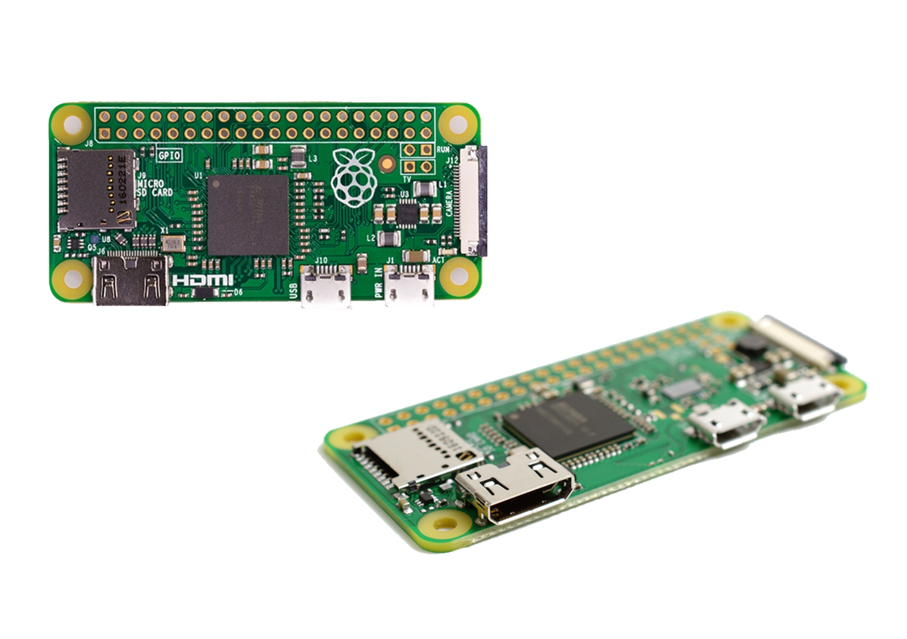


### 2.2.1 Raspberry Pi Power Supply
The Raspberry Pi can be operated with any mobile phone USB power supply and a Micro-USB cable. In my case, I use the original power supply from Raspberry.

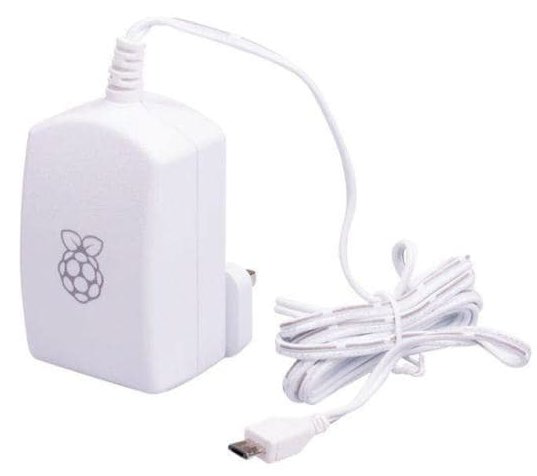

## 2.3 Display (Monitor)
For the visual representation of the Magic Mirror, I need a display or a monitor. I have removed the display from an old laptop, which is perfect for such a project. A disadvantage is that the display is old and the black is very bright. Good displays of the appropriate size are very expensive, so I decided on the old one. I also have the power supply and HDMI cable for the display.

| Diagonal (inches) | Diagonal (cm) | Width (cm) | Height (cm) | Type of Device | Resolution |
| --- | --- | --- | --- | --- | --- |
| 15.6 | 39.6 | 33.5 | 19.4 | Standard size for laptops | 1366 x 768 |

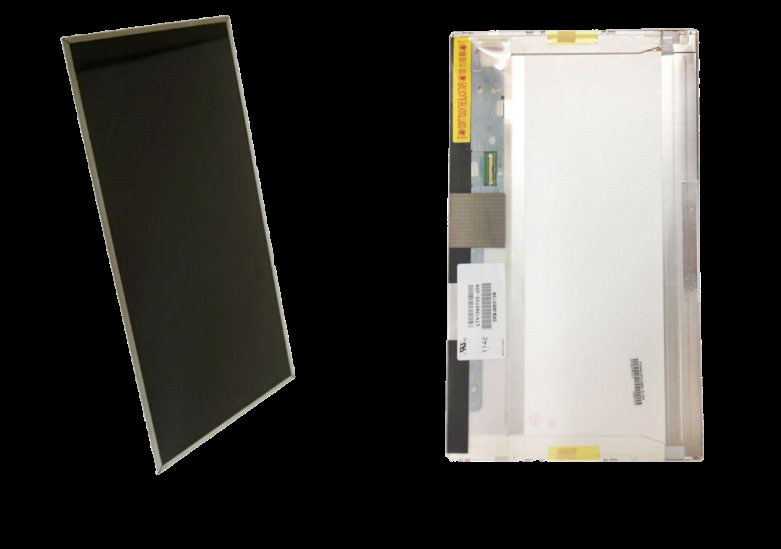

## 2.4 Display Interface
The display is to be used outside the laptop, so it needs an interface. It is connected via the flat ribbon connector on the display and offers various connections depending on the version. In my case, the interface has the following connections: HDMI, VGA, DVI, 3.5mm Jack IN & OUT, and 12V power supply. Most interfaces have push buttons like those known from a monitor, with which you can adjust display settings such as brightness, contrast, etc.

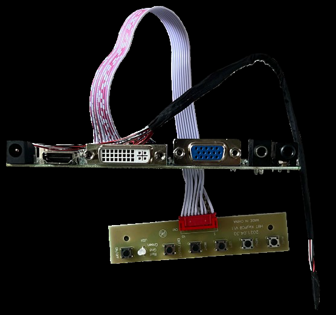

### 2.4.1 Display Universal Power Supply 12 Volt
The display needs to be powered, for this a 12V universal power supply is necessary. They are available in various versions, for example with manual output. I chose one that outputs exactly 12V.


## 2.5 HDMI Cable
The Raspberry Zero W is connected to the display with a Mini-HDMI to HDMI cable, so that the MagicMirror² is displayed. The Raspberry Pi 3 can be operated with a normal HDMI cable.

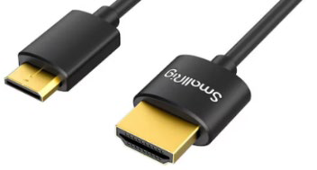

## 2.6 Mirror (Spy Mirror)
A mirror must not be missing in a Smart Mirror, it is not a normal mirror as known from the bathroom, but a semi-transparent mirror. A so-called police mirror or spy mirror. Unlike normal mirrors, this one lets light through, I use this effect later for the display. There is also the possibility to use a film that has the same property. I prefer to use a normal mirror because the quality is much better than that of the film. I had such a mirror made at https://www.brigla-shop.de/spiegel-smart-mirror, the Chrom Spy 4mm.

Dimensions: W: 27cm H: 36cm D: 0.4cm

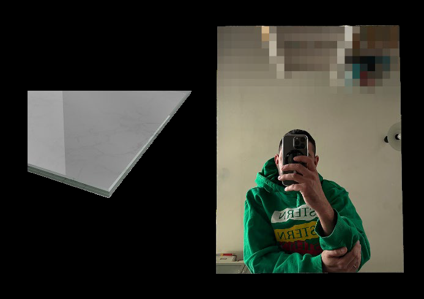

## 2.7 Wood for a Frame
I had the picture frame made to measure. I use a frame of the appropriate thickness to fix the display and store the corresponding electronics behind it. I ordered this picture frame here: https://www.bilderrahmen-passt.de

Dimensions: W: 27cm H: 36cm D: 3cm

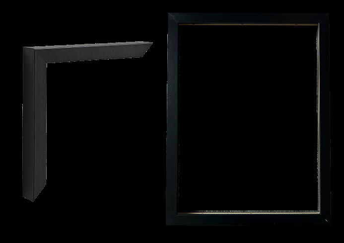

## 2.8 Mounting Material and Tools
I have some screws and mounting material at home that I can use. If I had a 3D printer, I would print the corresponding parts: angles to fix the display. The following tools are needed: drill, cross, flat screwdriver.


# 3 Setting up Raspberry PI 3
## 3.1 Installing Raspberry Pi OS
The OS of the Raspberry Pi is stored on a Micro SD card. The image must be written to the SD card with a tool so that the Raspberry can boot. Raspberry Pi OS comes with an "Imager Tool" that can be downloaded for Windows. The tool simplifies the creation of the image.

After the image is written, remove and reconnect the SD card to the computer and create a .txt document named ssh.txt on the SD card. The ".txt" must be removed from the filename so that ssh is already activated after the first boot process.

Textdocument.txt → ssh.txt → ssh

In order for the Raspberry to be configured and then MagicMirror² to be installed, you should now connect the mouse, keyboard, and display to the Raspberry Pi before the first boot process.

An alternative is to use the Command Line Interface, I chose this variant because I am more familiar with it than with the graphical interface of Raspberry OS. The Bitvise SSH Client program is used to connect to the Raspberry.

ssh pi@192.168.0.xxx
(the IP must be read from the router interface and can vary)
The IBZ user can be defined when creating the image:

Default user: `pi`
Password: `raspberry`

New user: `example123`
Password: `your Password`

First, the Raspberry is updated with the command:

```
sudo apt-get update && apt-get upgrade -y
update updates the repositories where the packages are stored
upgrade updates the installed packages on the Raspi
-y confirms the installation request with yes
```

# 4 Downloading and Installing Magic Mirror² Software
MagicMirror² is a modular open-source platform for smart mirrors. With a growing list of installable modules, MagicMirror² can transform the hallway or bathroom mirror into a personal assistant. MagicMirror² continues to be developed with the incredible help of a growing community.

MagicMirror² focuses on a modular plugin system and uses Electron as an application wrapper. So no further web server or browser installations are necessary!

There are two ways to install MagicMirror² on the Raspberry. A manual installation and an installation script that performs the installation automatically. The installation script is not maintained by the MagicMirror² core team. The use of these scripts and methods is at your own risk.

## 4.1 Downloading and Installing the Latest npm Software
Downloading and installing can take up to 30 minutes. During this time, it may be that very little happens on the screen for a long time, just be patient and wait.

Commands:

installs the latest Node.js version
```
curl -sL https://deb.nodesource.com/setup_16.x | sudo -E bash –
sudo apt install -y nodejs
```
clones a repository and creates the MagicMirror² directory
```
git clone https://github.com/MichMich/MagicMirror
```
navigate to the Magic Mirror folder
```
cd MagicMirror/
```
installs npm
```
npm install
```
everything necessary is installed

## 4.2 Backing up and Starting Magic Mirror² Configuration
The configuration of Magic Mirror² is done via a configuration file. The correct use of the syntax is very important! A small mistake leads to nothing being displayed. First, the configuration file is backed up. Care should be taken not to make several changes at the same time, so that the error can be identified and corrected more quickly.

With the command:
```
cp config/config.js.sample config/config.js
```
a copy is created.
Once the config.js is backed up, the software can be started for the first time, with the command:
```
npm run start
```
The Magic Mirror² will start if all steps have been executed correctly. The Smart Mirror has a pre-configured display. The date, time, calendar, weather, a line of text in the middle, and news from the New York Times should be visible.


## 4.3 Downloading and Configuring Own Module
I used the following modules:

- Time, 
- day of the week, and 
- date (standard module)
- Current weather and forecast for 5 days (standard module)
- Bus timetable (3rd party module)
- Calendar with the timetable calendar subscription from IBZ (standard module)
The bus timetable must be installed additionally, the other modules are installed during the installation of MagicMirror².

### 4.3.1 Download Bus Timetable Module
On GitHub under this link: https://github.com/MichMich/MagicMirror/wiki/3rd-Party-Modules
there are countless modules that have been created by the community. There I downloaded the bus timetable module MMM-SwissStationboard. With this module, all public transport connections in Switzerland can be configured.

### 4.3.2 Install MMM-SwissStationboard
The module from MagicMirror² must be downloaded and installed in the correct folder:
```
cd ~/MagicMirror/modules
```
Now you need to copy the GitHub files of the desired module into the module folder.
This can be done with the following command:
```
git clone https://github.com/vanhoekd/MMM-SwissStationboard
```
In some cases, the MagicMirror² modules require other software components to function correctly. These should therefore be installed beforehand.
Almost every module provides an installation script for this.

Change to the module directory:
```
cd ~/MagicMirror²/modules/MMM-SwissStationboard
```
and start the installation:
```
npm install
```
### 4.3.3 Configure MMM-SwissStationboard
The required data and software components have been installed. In order for the module to be loaded at the next start, the MagicMirror² must be configured accordingly.

With the following command, you can access the config to configure the MMM-SwissStationboard module in MagicMirror²:
```
sudo nano ~/MagicMirror/config/config.js
```
In this config, all modules are listed that should be displayed on the display. The following lines must be added:
```
{
module: 'MMM-SwissStationboard',
position: 'top_left',
header: 'Bus 34 - In the homeland',
config: {
stop: 'In-the-homeland', // Start train station
maximumEntries: 5, // Max departures displayed
minWalkingTime: 10, // Minimum time to get to the station
hideNotReachable: 0, //Will hide all the not reachable connections
hideTrackInfo: 0,
}
},
```
The formatting in this config is very IMPORTANT, otherwise the modules cannot be read!
Attached is a screenshot of my config, in which the MMM-SwissStationboard module is framed in red. Further down I tried the MMM-ImageSlideshow module to display the timetables of my children as alternating images. The entries could not be read well because the display is too small, so I removed it or commented it out.

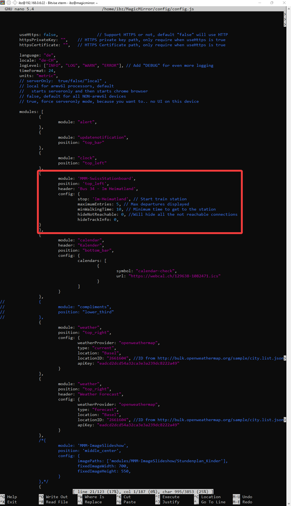

In the same config, the positions of the individual modules are also defined. The following picture shows all positions that can be assigned to the modules. Each module has the "Position" point in the config, where the corresponding information is made.

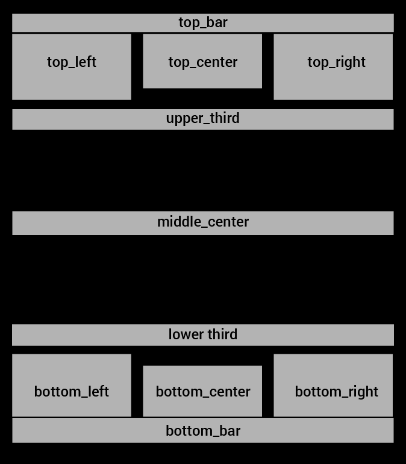

In the middle, no information is deliberately displayed so that there is still a mirror function.

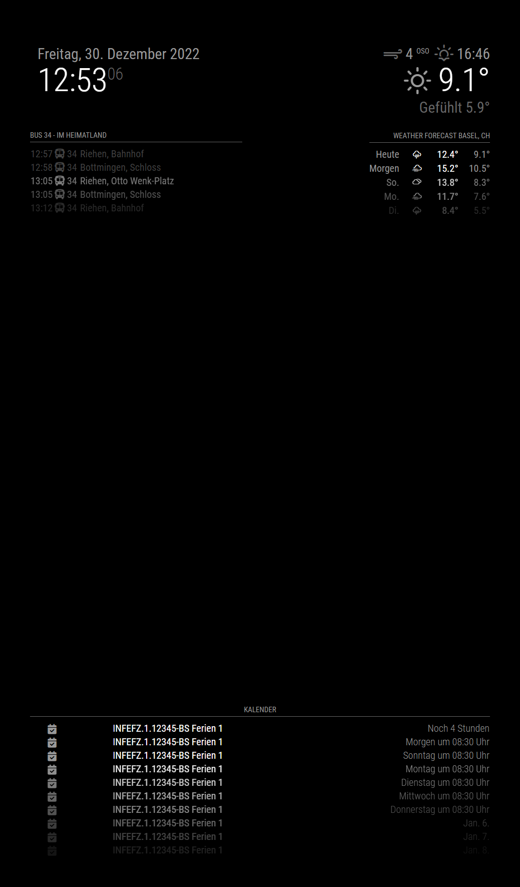

Up to here, the installation of a Raspberry Pi 3 is completed, if you use a Raspberry Pi Zero W, you have to take a few extra steps or use the MagicMirror² server to successfully complete the installation.

# 5 Setting up Raspberry Pi Zero W
## 5.1 Installing Raspberry OS
The installation of Raspberry OS lite is the same as for the Raspberry Pi 3, only that the lite image is used. Raspberry Pi OS Lite is a slim Raspian. The slimmed-down image comes without a graphical interface (GUI) and only with the necessary programs. It therefore fits on a memory card with a low storage capacity.

Cross-reference: Installing Raspberry Pi OS

# 6 Downloading and Installing Magic Mirror2 Software
The installation is a bit more complicated, as a version of NodeJS must be installed (which is not officially supported). Here are the steps:

Install Pi OS Lite
Set up Wifi and SSH
Connect via SSH
Here again, the Raspberry Pi Zero W needs to be updated with the command:
```
sudo apt-get update && apt-get upgrade -y
```
- **update** updates the repositories where the packages are stored
- **upgrade** updates the installed packages on the Raspi
- **-y** confirms the installation request with yes
On the Raspberry Pi Zero W, git must be installed additionally, because it is not installed with the lite version. The installation is started with the following command:
```
sudo apt install git
```
## 6.1 Install LTS 16.13.0 of node on the Zero W
With the following commands:
```
wget https://unofficial-builds.nodejs.org/download/release/v16.13.0/node-v16.13.0-linux-
armv6l.tar.xz
tar -xvf node-v16.13.0-linux-armv6l.tar.xz
sudo cp -R node-v16.13.0-linux-armv6l/* /usr/local
rm - rf node-v16.13.0-linux-armv6l/*
sudo reboot
```
Now you can check if the installation worked – with these commands:
```
node -v
npm -v
```
## 6.2 Installing MagicMirror²
The Raspberry Pi Zero W is prepared for the installation of MagicMirror².
The installation is started with the following commands:
```
git clone https://github.com/MichMich/MagicMirror
cd MagicMirror/
npm install – only=prod –omit=dev
```
As we know, MagicMirror² is set up via the configuration file. The correct syntax of the configuration file is very important, if there is a syntax error somewhere, the MagicMirror² will not display anything and just stay black. After everything is installed, you should create a backup of the original configuration file of MagicMirror² so that you can revert to the original file in case of syntax errors to understand where errors are present. You should also make sure that you do not make several changes at the same time, so that it can also be traced where the error lies and you can correct or undo the last change.

The following command creates a copy:
```
cp config/config.js.sample config/config.js
```
Now the configuration file can be changed according to our wishes.

## 6.3 Configuring MagicMirror²
In the MagicMirror² folder, the configuration file can be opened with these commands to get into the MagicMirror² folder and then open the configuration file with the Nano text editor:
```
cd MagicMirror/
sudo nano config/config.js
```
On the Raspberry Pi Zero W, the MagicMirror²
is run as a server, so the interface for the LAN connection must be changed in the config.

From:
```
address: "localhost"
```
To:
```
address: "::"
```
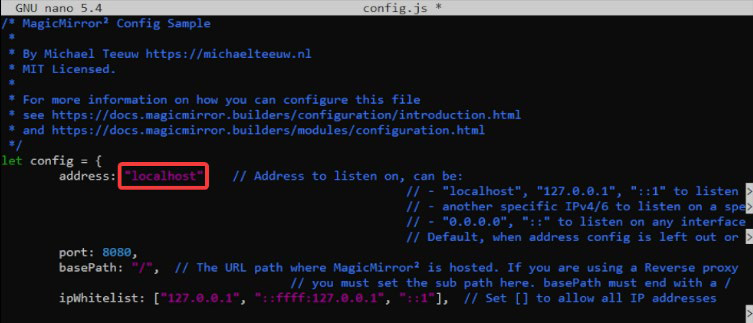
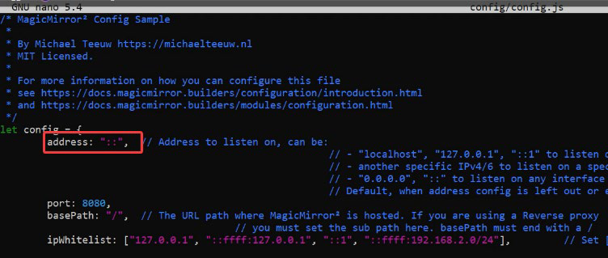

Now clients from the network can be allowed, for this the following parameters in the config file are changed.

From:
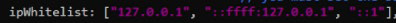

To:
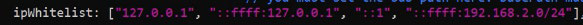

Now the config must be saved with ctrl `x` and `y` and the editor must be closed.

With the command:
```
npm run server
```
the MagicMirror² is executed and the website can be called up from an end device with the IP address of the Raspberry. If everything worked, you should see the standard MagicMirror² screen in the browser:


## 6.4 Additional Software
Now that I can manually run the server part of the software, I want to display the image on the screen that is directly connected to the Pi. For this, the X Window Server must be installed to get a "user interface". A browser must be installed to display the website. The program unclutter and some configurations must be set to hide the mouse cursor.

To install the additional software, the following commands are used:
```
sudo apt install chromium-browser xinit xorg matchbox unclutter
```
so that the programs start automatically. After a start, autostart scripts are created.
The following command creates the first script, which sets everything up and starts the server:
```
nano start_magic.sh
```
Content of the script:
```
#!/bin/bash
cd ~/MagicMirror
npm run server &
sleep 30
sudo chmod 660 /dev/tty*
xinit /home/pi/start_chromium.sh
```
After everything has been inserted into the created script, it is saved and closed with `ctrl x` and `y`

The server is started in the background and then updates the rights for the tty devices. I'm not sure why the Xinit program needs these, but in my case, it didn't start any other way. Also, make sure that the user being used is in the tty group. If the user is named `pi`, the command `sudo usermod -a - G tty pi` can be used to add him.

Finally, the file starts the x-server environment and calls the second script.

The second script starts the browser and points it to the correct local website.

The following command creates the second script:
```
nano start_chromium.sh
```
Then the following is copied into the script:
```
#!/bin/sh
DISPLAY=:0 xrandr --output HDMI-1 --rotate right
unclutter &
xset -dpms # disable DPMS (Energy Star) features.
xset s off # disable screen saver
xset s noblank # don’t blank the video device
matchbox-window-manager &
chromium-browser --incognito --kiosk http://localhost:8080/ # MagicMirror
runs on 8080 by default
```
After everything has been inserted into the created script, it is saved and closed with `ctrl x` and `y`.

The display line in the script rotates the connected screen 90° to the right, as it is installed in the frame. This setting must always be made after a restart, which is why it is in this script.
After that, it starts the Unclutter program to hide the cursor, disables some screensaver settings, and finally starts the Chromium browser to display the website. If the port in the MagicMirror² configuration file was changed, it also needs to be adjusted in this script.

Now the Raspberry should be able to start the software via `./start_magic.sh`. The script only runs until the Pi is restarted.

## 6.5 MagicMirror² Autostart Raspberry Pi Zero W
Configure the autostart, with the command:
```
sudo raspi- config
```
A menu opens, here it is set that Raspberry should automatically log in without password query. Use the arrow keys to navigate and the Enter key to confirm the setting.

Press Enter in System Options (1)

Then use the down arrow key
to Boot / Auto Login (2) and
confirm with Enter

Again down to Console
Autologin (3) and confirm with Enter
or use the right arrow key
until you are on OK (4) and confirm
with Enter

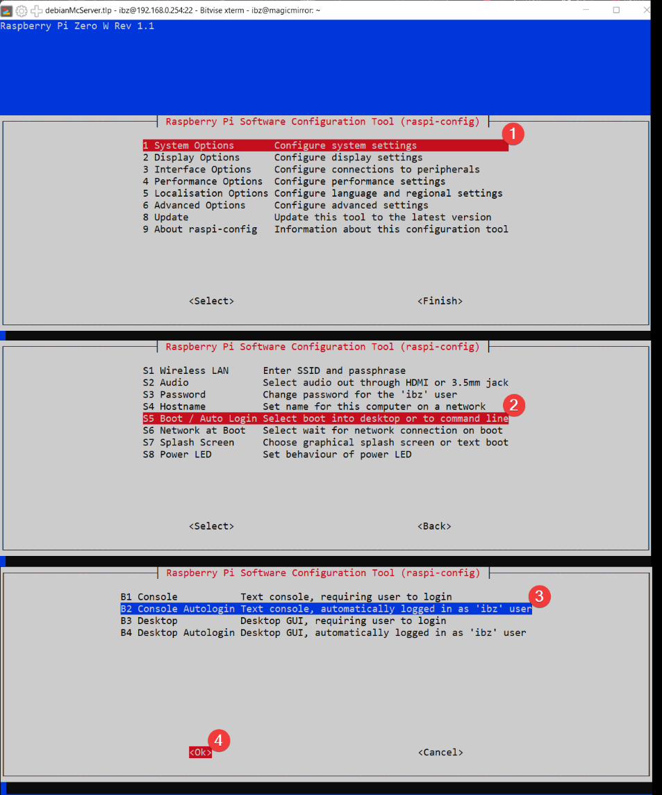

Now you need to add a few lines to the "profile file" to start the scripts:
```
nano .profile
```
The following lines need to be added at the end:
```
if [ -n "$SSH_CLIENT" ] || [ -n "$SSH_TTY" ]; then
echo "Hello, SSH!" # SSH session, do not try to launch SmartMirror, or
it will make configuring things difficult
else
sh ~/start_magic.sh # Not an SSH session, run SmartMirror
fi
```
After that it should look like this and you can save and close the file with `ctrl x`, `y` and `Enter`:

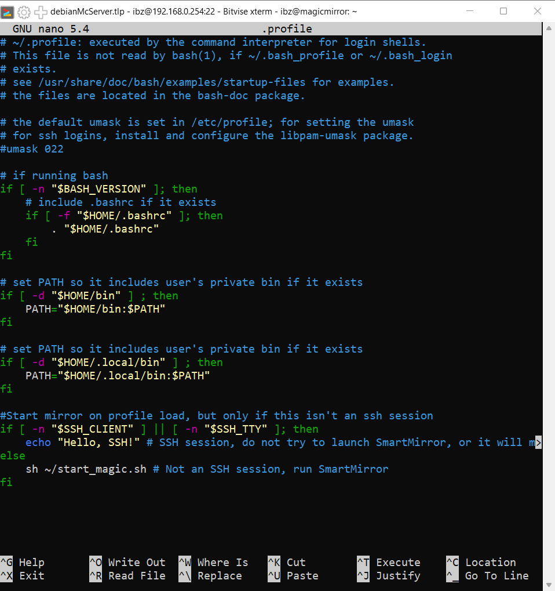

# 7 Backup
I want to create a backup of the SD card, as a Micro SD card unfortunately has a limited lifespan. This depends on the number of read and especially write accesses. Linux writes all the time in various log files. The more programs, the more is written. That's why I have gotten into the habit of creating a backup of finished projects by securing the entire SD card.

## 7.1 Install Backup Tools
The following programs are needed to create a backup:

- Win32 Disk Imager
- Balena Etcher
- 7zip
If they are not already installed, you should download and install them

Shut down Raspberry Pi if it hasn't already been done.
**Important!** You should not just pull the power. If the Raspberry is currently writing data, this can end fatally. It is best to log in via ssh on the Pi, with the command:
```
sudo shutdown -h now
shut down
```
### 7.1.1 Start Win32 Disk Imager
Start the program and in the dropdown at
Disk select the SD card to be backed up (1)
At Image File you can assign any name
and define a storage location. (2)
Then click on the Read button. (3)

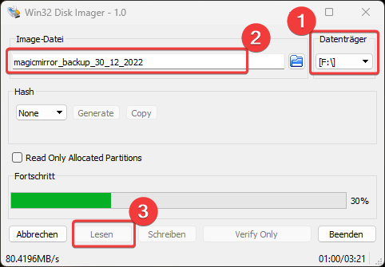

Wait until the process is finished and this message appears:

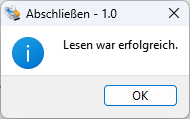

Now the backup is actually already created but the backup
has the 1:1 size of the SD card, because it is an image of it.
That means now 16 GB are lying on my hard drive. To
use less space, the image is packed with 7zip
Important at this step is that you select the
algorithm bzip2 (1) and the compression Ultra (2).
These settings are important because balena Etcher
can only read certain packing formats.

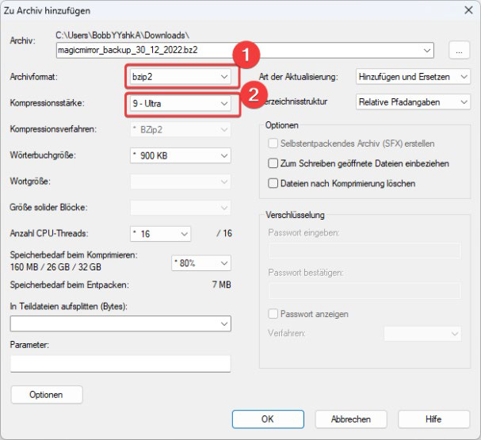

The compression process takes a while.

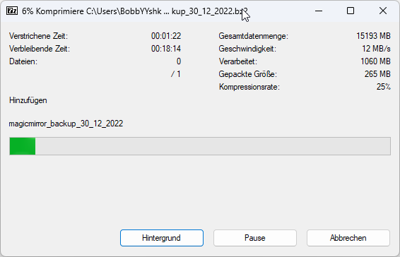

The result of the compression is very good, as
you can see it has shrunk from 16 GB to 1.4 GB.


### 7.1.2 Restore and test backup
What good is a backup if you don't know if it works, so I will test it with a new SD-
card and restore it.

With balena Etcher the created backup should be restored to a new SD card and tested.

balenaEtcher is self-explanatory so I present it in a screenshot series:


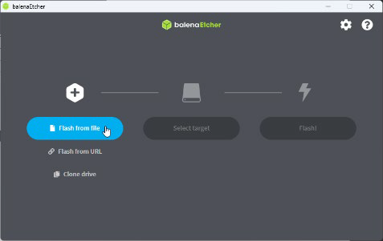
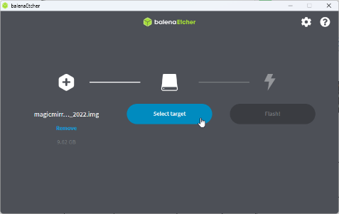
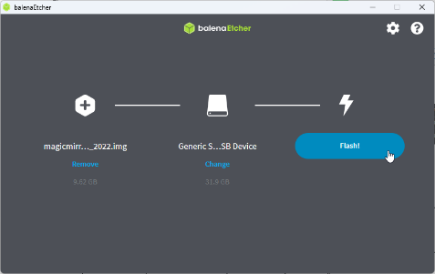
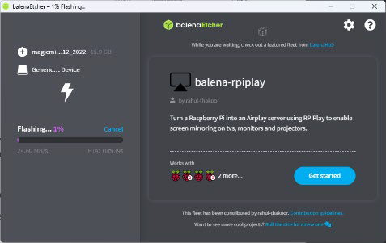
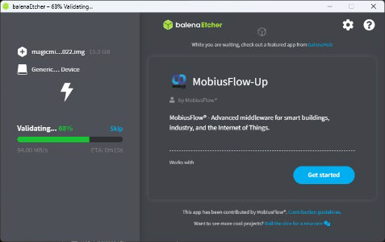
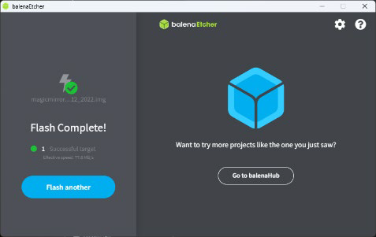

# 8 Miscellaneous
## 8.1 Configuring Multiple WiFis
In the `wpa_supplicant.conf`, it is possible to configure multiple WiFis. I have taken advantage of this, for example, to connect the mirror to my mobile hotspot during a presentation outside of my home. This way, the modules can be loaded without having to reconfigure the WiFi.

I have configured it so that my home WiFi is prioritized and if no connection can be established, the Raspberry Pi tries to connect to my hotspot.
```
/etc/wpa_supplicant/wpa_supplicant.conf
```
```
ctrl_interface=DIR=/var/run/wpa_supplicant GROUP=netdev
update_config=1

network={
ssid=" Home Wifi "
psk=" Password "
priority=1
}

network={
ssid=" Hotspot Wifi "
psk=" Password "
priority=2
}
```
The bold information in the quotation marks " ... " must match the respective WiFi and be replaced with your own information.

# 9 Conclusion
Building the mirror and setting it up with Linux or Raspberry Pi OS was a lot of fun. I was able to express my creativity by thinking about which modules I wanted to integrate and how.

The planning and implementation were sometimes challenging, especially with the Raspberry Pi Zero W, which I found exciting. For example, I learned that you can open the browser in the terminal. It got tricky because MagicMirror uses note js, but there is no download from Raspberry for the architecture of the small Pi. However, with some detours, you can still install it and the MagicMirror can only be installed as a server. I had to deal with the topic of kiosk users, which we actually covered during the lesson. This allowed the Magic Mirror to be displayed in the Pi's own browser. I found it very interesting what all the possibilities are to install MagicMirror and to carry out this project in a different way.

If you simply do the installation with the script from the MagicMirror page, everything necessary is automatically installed. I didn't want that, so I installed all necessary applications individually, which was not much more effort if you are a little familiar with Linux.

For a next MagicMirror project, I would like to use more technical accessories, such as motion sensors, touchscreen or facial recognition. However, this would involve significantly higher costs.

I have already done other Linux or Raspi projects, but these were not sustainable because they were not performant enough. Therefore, I usually deleted them quickly. However, this project will definitely hang on my wall at home for a longer time and find use.

# 10 Pictures
## 10.1 Backside

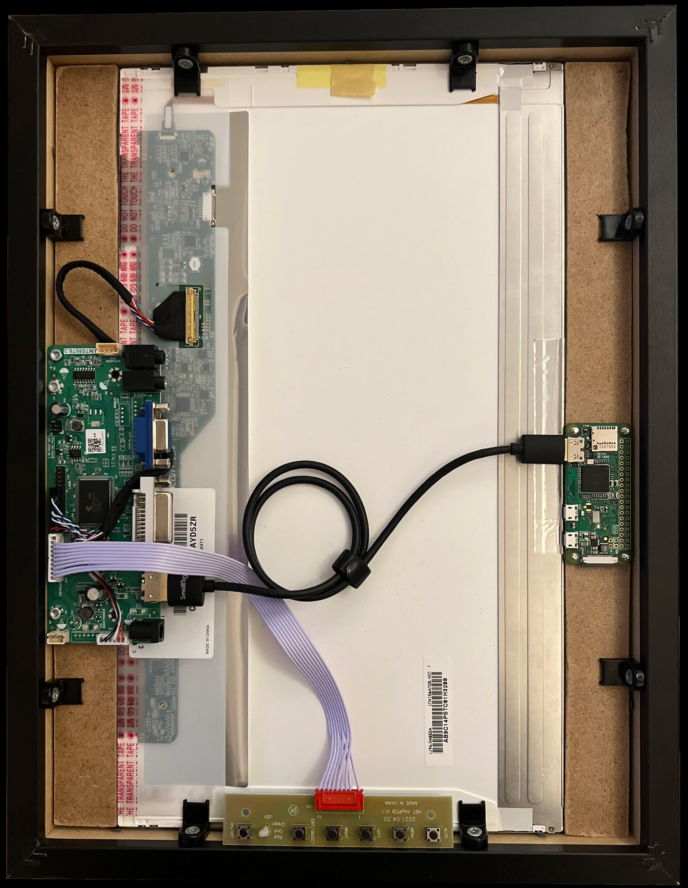

## 10.2 Front side

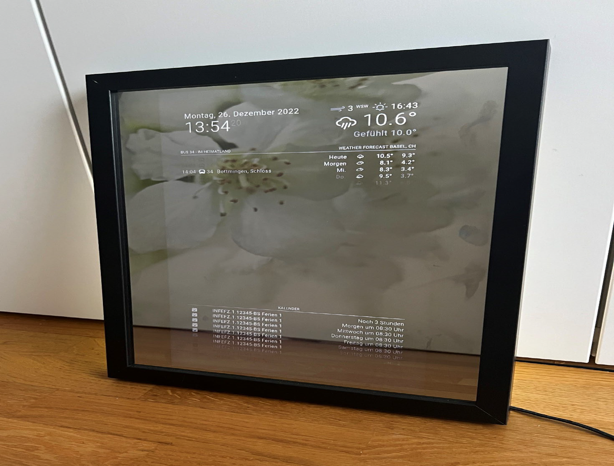